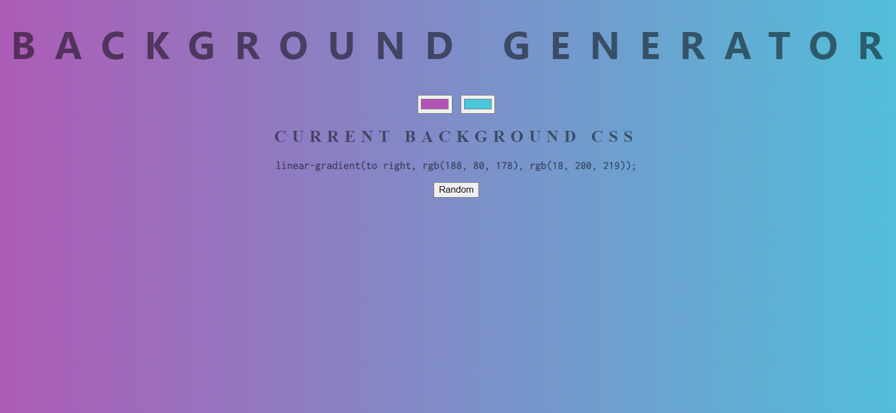

# Background-Gradient-Generator
Basic JavaScript code to randomize (or select 2 colors from a pallet) and display the resulting gradient along with the rgb-hex code  
[https://background-gradient-generator.firebaseapp.com/](https://background-gradient-generator.firebaseapp.com/)
  

